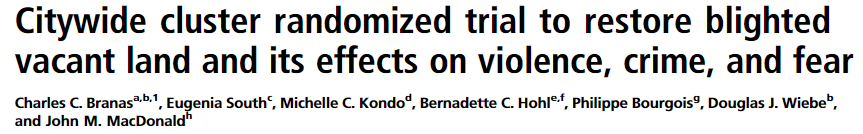
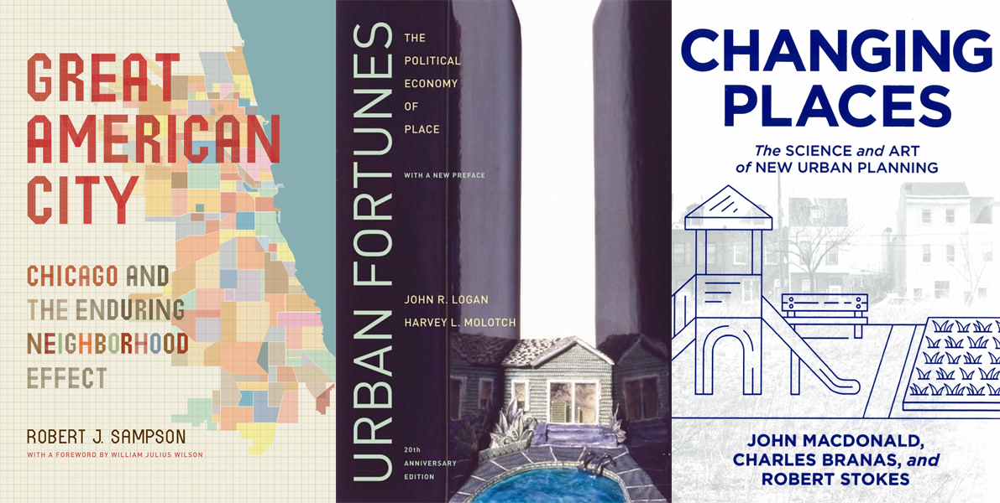
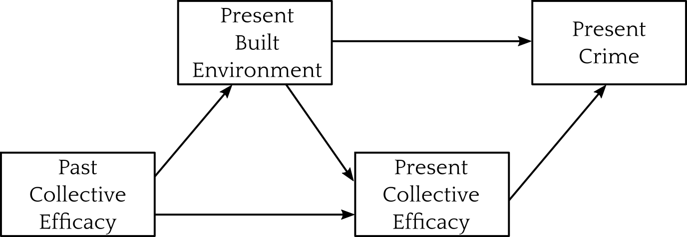
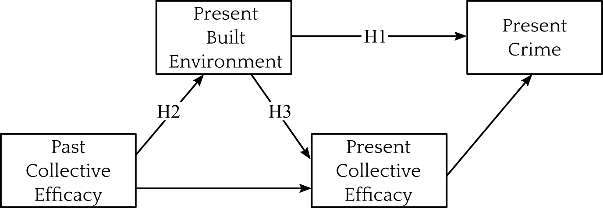
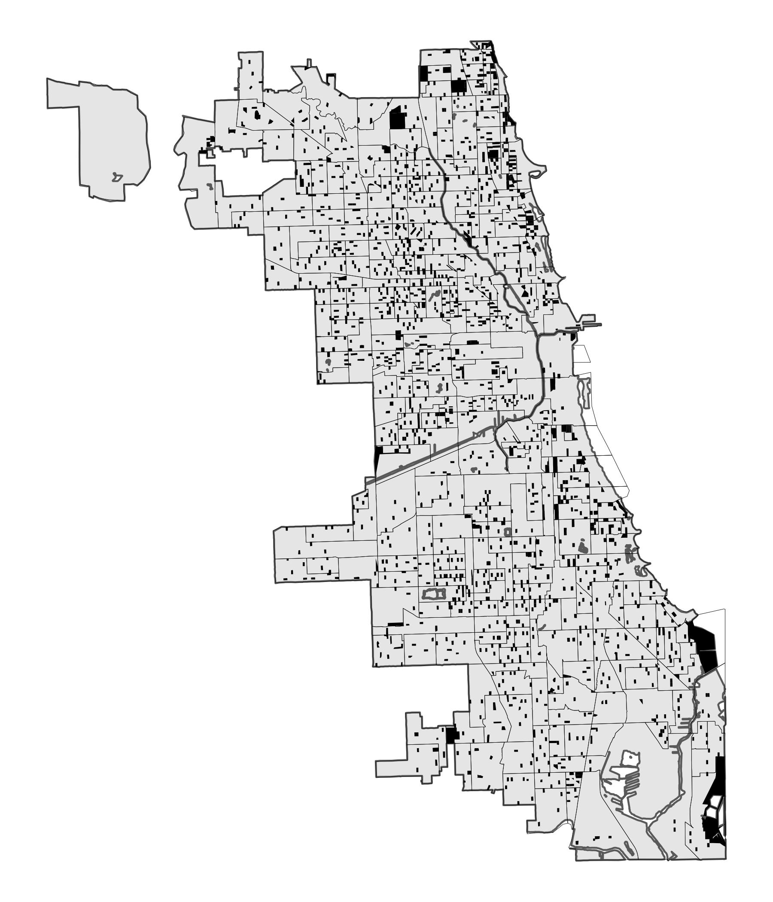
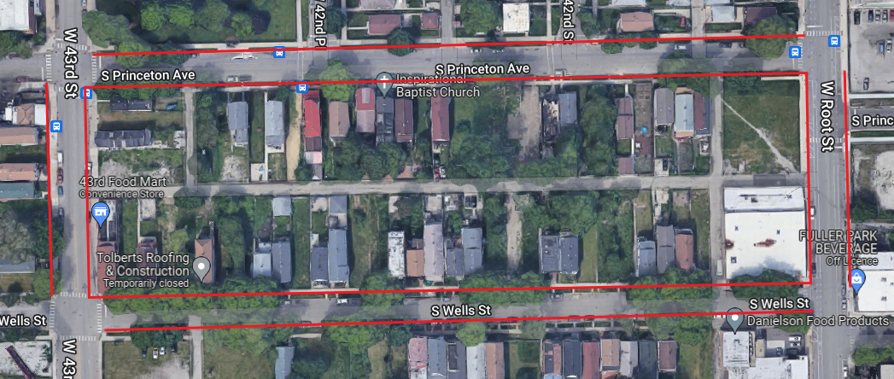
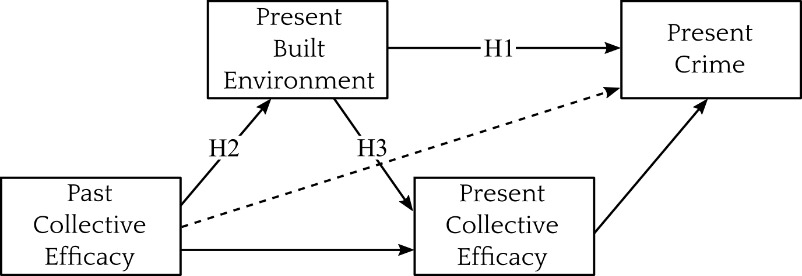
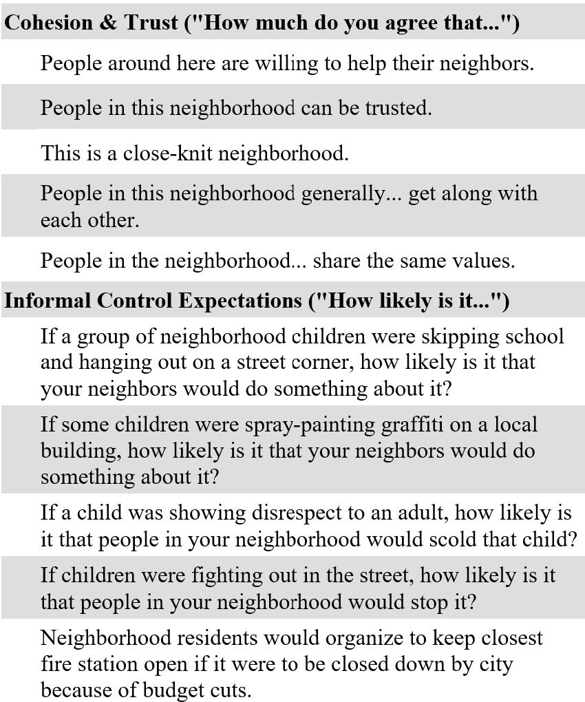
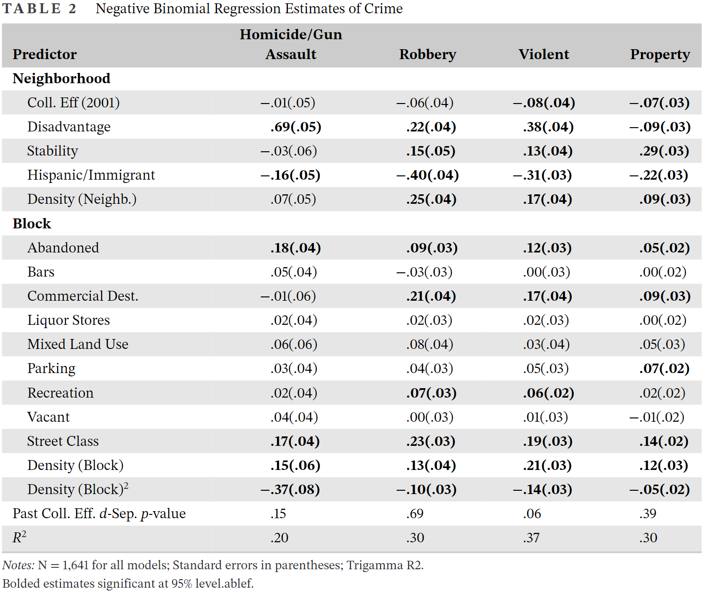
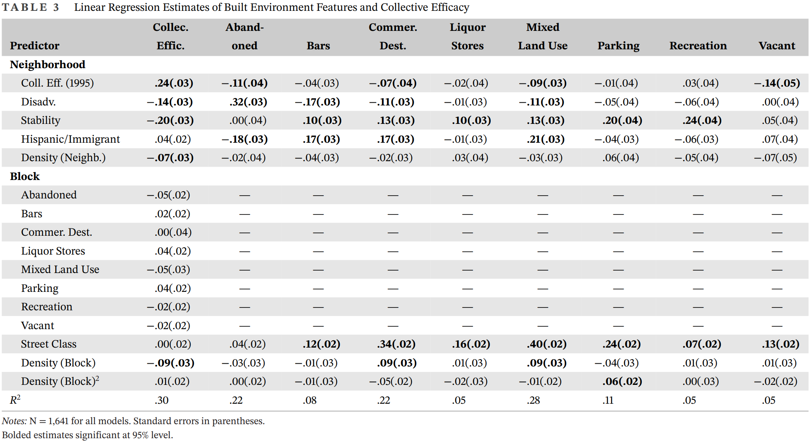

```{r setup, include=FALSE}
knitr::opts_chunk$set(echo = FALSE)
```

<br>

.image-480[

]


---

.image-480[

]

---



--


---

# The Questions

### Relationship between the built environment and crime is well-established

&nbsp;

--

### Experimentally .bam[assigning] built environment treatments reduces crime

&nbsp;

--

### What is the natural assignment .bam[process]?

---

# Making Connections



---
class: inverse

# The Paper

---
# Collective Efficacy

*Collective efficacy is a problem-solving capacity that explains why crime is concentrated in certain neighbourhoods: it influences social control* <sup>1</sup> 

<br>


.footnote[.small[[1] Sampson, Raudenbush, & Earls 1997; Sampson 2012]]

???

Collective efficacy theory says residents can make neighborhoods safer by developing social ties and social capital to bolster collective action against crime.

Consistent empirical support across multiple sites and countries

---
# The Built Environment

*The built environment explains why crime is concentrated in particular places within neighbourhoods: it influences opportunity* <sup>1</sup> 

<br>


.footnote[.small[[1] Cohen & Felson 1979; Sherman, Gartin, & Buerger 1989; Wilcox & Cullen 2018]]

???

SOme features of the built environment are criminogenic in the sense that they generate opportunities for crime.

Similarly consistent empirical support

---
# The Idea

*Given that...*

* Residents recognize that some features of the built environment are criminogenic (e.g., abandoned buildings, bars, vacant lots) <sup>1</sup>

.footnote[.small[[1] Innes 2004 [2] Donnelly & Kimball 1997 [3] Sampson 2012 [4] Logan & Molotch 1987]]

--

* Residents act collectively to address these problems <sup>2</sup>

--

* Collective efficacy makes collective action more frequent and effective <sup>3</sup>

--

* The built environment changes slowly, for physical and institutional reasons <sup>4</sup>

--

**Neighbourhoods with high collective efficacy in the past will have low crime in the present because they prevented and removed criminogenic features of the built environment.**

---
# Use Value


> ... potentially criminogenic
features of the built environment also serve noncriminal purposes, and thus, they are not perceived
solely as problematic. Simply removing all features that might facilitate crime is not a valid
solution because they are necessary for the routine activities of people... Control of crime facilitated by the built environment
exists in tension with the legitimate uses of space. Criminogenic features perceived to offer little
benefit to residents—such as abandoned buildings and vacant lots—are thus likely to be subject
to stronger removal efforts.

- Lanfear (2022:3)

---
# Theoretical Model

.image-center[

]

???

The built environment and collective efficacy predict crime, but past collective efficacy influences the built environment.

Some environment features foster or inhibit use of space and interaction; this impacts social capital foundation of CE


---
# Hypotheses

.image-center[

]

* H1: Some present built environment features are criminogenic

--

* H2: Past collective efficacy reduces present criminogenic built environment features

--

* H3: Criminogenic features reduce present collective efficacy

--

* Implied: No effect of past collective efficacy on present crime

---
# Chicago Data


.pull-left[

* Community Surveys
   * PHDCN Community Survey
   * Chicago Community Adult Health Study (CCAHS)

]
.pull-right[

.center[*1641 blocks nested in 343 neighbourhood clusters*]
]

---
count:false

# Chicago Data


.pull-left[

* Community Surveys
   * PHDCN Community Survey
   * Chicago Community Adult Health Study (CCAHS)
* Chicago Police Department reported crimes
   * Homicide / Gun Violence
   * Robbery
   * All violent crime
   * All property crime

]
.pull-right[

.center[*1641 blocks nested in 343 neighbourhood clusters*]
]

---
count:false

# Chicago Data


.pull-left[

* Community Surveys
   * PHDCN Community Survey
   * Chicago Community Adult Health Study (CCAHS)
* Chicago Police Department reported crimes
   * Homicide / Gun Violence
   * Robbery
   * All violent crime
   * All property crime
* City of Chicago street network
* LTDB: 3 factors, 9 indicators
   * Concentrated Disadvantage
   * Residential Instability
   * Hispanic/Immigrant Conc.

]
.pull-right[

.center[*1641 blocks nested in 343 neighbourhood clusters*]
]

---

# CCAHS Observation

*Proportion of block faces with features present:*<br>
.pull-left[
Abandoned Buildings<br>
Bars<br>
Commercial Destinations<br>
Liquor Stores
]
.pull-right[
Mixed Land Use<br>
Parking Lots<br>
Recreation Facilities<br>
Vacant Lots
]

.image-80[

]


---
# Methods

.image-center[

]


1. Hierarchical measurement models for collective efficacy

--

2. Piecewise structural equations to test hypotheses

   * Hierarchical negative binomial (H1) and linear regressions (H2, H3)
   * D-separation tests of past collective efficacy and each type of present crime (dashed)

---

.image-540[

]

---

.image-480[

]

---

.image-480[

]

--

.pull-right30[
.footnote[
Highly reliable within individuals, fairly consistent over time
]
]

---

.image-480[

]

--

.pull-right30[
.footnote[
Measures highly reliable in 1995 (0.76) but not 2003 (0.50). See my appendix!
]
]

---

.image-540[

]


---
# Key Results


.image-center[]


* H1: Abandoned buildings increase homicide/gun assault and violence<br>&emsp;&thinsp;&thinsp;&nbsp;&nbsp;Commerce increases robbery, violence, and property crimes

???

Thick lines indicate stronger support.

--

* H2: Past collective efficacy reduces abandoned buildings, commercial destinations, mixed land use, and vacant lots.

--

* H3: No built environment features predict present collective efficacy
   
---
# Implications

Control of the built environment is important:

* May promote neighbourhood stability, health, and livability
* Implicates collective efficacy in segregation, concentrated disadvantage, and public (dis)investment
* Interventions that increase informal control capacity may not increase environmental control

--

Integrates collective efficacy with existing theory:

* Criminal opportunity (e.g., Cohen & Felson 1979)
* Political economy of place (e.g. Logan & Molotch 1987)
* Public social control (e.g. Bursik 1989; Velez 2001)


---

# Future Work


* Methods for ecological measurement

   * Review book chapter with Thiago Oliveira
   * Paper with new approaches
      * Multilevel two-stage IRT

--

* Vertical theoretical integration—from political economy to the situation

   * Micro-macro theory of perception, opportunity, and control
   * Collaborating with Ross Matsueda

--

* Conditions and methods for action to impact built environment

   * Importance of institutional responsiveness
   * Points of intervention
   
---
count: false
class: inverse

# *Thank You!*

---
count: false
class: inverse
# Appendix

---
count: false

.image-540[

]

---
count: false

<br>
<br>

.image-center[

]

---
count: false
# Model Fit Example


---
count: false
# References

.smaller[
* Bursik, Robert J. 1989. “Political Decision-Making and Ecological Models of Delinquency: Conflict and Consensus.” Pp. 105–18 in Theoretical integration in the study of deviance and crime: Problems and prospects, edited by S. F. Messner, M. D. Krohn, and A. E. Liska. Albany, NY: State University of New York Press.
* Carr, Patrick J. 2005. Clean Streets: Controlling Crime, Maintaining Order, and Building Community Activism. New York: New York University Press.
* Cohen, Lawrence E., and Marcus Felson. 1979. “Social Change and Crime Rate Trends: A Routine Activity Approach.” American Sociological Review 44(4):588–608. doi: 10.2307/2094589.
* Donnelly, Patrick G., and Charles E. Kimble. 1997. “Community Organizing, Environmental Change, and Neighborhood Crime.” Crime & Delinquency 43(4):493–511. doi: 10.1177/0011128797043004006.
* Innes, Martin. 2004. “Signal Crimes and Signal Disorders: Notes on Deviance as Communicative Action.” The British Journal of Sociology 55(3):335–55. doi: 10.1111/j.1468-4446.2004.00023.x.
* Logan, John R., and Harvey Luskin Molotch. 1987. Urban Fortunes: The Political Economy of Place. University of California Press.
* Sampson, Robert J. 2012. Great American City: Chicago and the Enduring Neighborhood Effect. Chicago, Ill.: Univ. of Chicago Press.
* Sampson, Robert J., Stephen W. Raudenbush, and Felton Earls. 1997. “Neighborhoods and Violent Crime: A Multilevel Study of Collective Efficacy.” Science 277(5328):918–24. doi: 10.1126/science.277.5328.918.
* Sampson, Robert J., and Stephen W. Raudenbush. 1999. “Systematic Social Observation of Public Spaces: A New Look at Disorder in Urban Neighborhoods.” American Journal of Sociology 105(3):603–51. doi: 10.1086/210356.
* Sherman, Lawrence W., Patrick R. Gartin, and Michael E. Buerger. 1989. “Hot Spots of Predatory Crime: Routine Activities and the Criminology of Place.” Criminology 27(1):27–56. doi: 10.1111/j.1745-9125.1989.tb00862.x.
* St. Jean, Peter K. B. 2007. Pockets of Crime: Broken Windows, Collective Efficacy, and the Criminal Point of View. Chicago: University of Chicago Press.
* Velez, Maria B. 2001. “The Role of Public Social Control in Urban Neighborhoods: A Multilevel Analysis of Victimization Risk.” Criminology 39(4):837–64. doi: 10.1111/j.1745-9125.2001.tb00942.x.
* Wilcox, Pamela, and Francis T. Cullen. 2018. “Situational Opportunity Theories of Crime.” Annual Review of Criminology 1(1):123–48. doi: 10.1146/annurev-criminol-032317-092421.
]